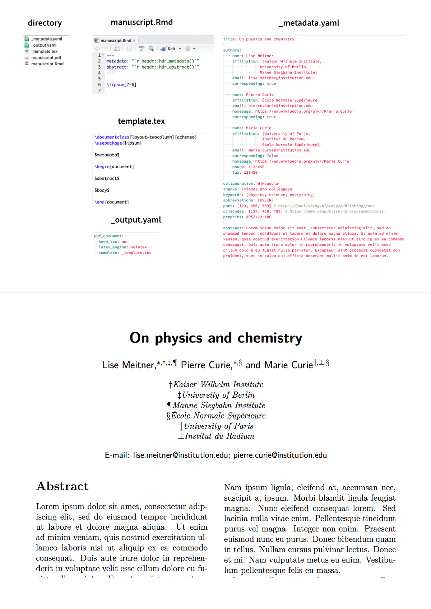

The problem with LaTeX templates
--------------------------------

Practically every journal supplying a LaTeX template defines its own
custom macros for author affiliations and other metadata, with very
little consistency from one publisher to another. This renders the
process of re-submitting a manuscript to a new journal really
cumbersome. Consider the following two examples:

**OSA**

    \title{Manuscript Title}

    \author[1,2,3]{Author One}
    \author[2,*]{Author Two}

    \affil[1]{First address}
    \affil[2]{Second address}
    \affil[3]{Third address}

    \affil[*]{Corresponding author: email@my-email.com}
    \dates{Compiled \today}
    \ociscodes{(140.3490) Lasers, distributed feedback; (060.2420) Fibers.}

**ACS**

    \title{Manuscript title}

    \author{Author One}
    \affiliation{First address}
    \alsoaffiliation{Second address}
    \email{email@my-email.com}

    \author{Author Two} 
    \phone{+123456789}
    \fax{+123456789}
    \email{email@my-email.com}
    \affiliation{First address}
    \alsoaffiliation{Second address}
    \alsoaffiliation{Third address}

    \abbreviations{IR,NMR,UV}
    \keywords{American Chemical Society}

The pandoc way
--------------

pandoc provides a way to populate latex templates with custom metadata
stored in a human-readable yaml format. Unfortunately, the template
itself is coded in tex – not the easiest language to work with.

    $if(abstract)$
    \abstract{%
    $abstract$
    }
    $endif$

    $body$

    $for(author)$
    \address{%
    $author.name$\\
    $author.affiliation$\\
    $for(author.address)$$author.address$$sep$\\ $endfor$\\
    }
    $if(author.email)$$author.email$$endif$

    $endfor$

A standardised, human-readable format
-------------------------------------

We'll store the metadata in an external file, in `yaml` format.

    title: "Here and there again: harnessing non-locality in invisibility cloaks"
    date: "\\\\today"

    authors:
      - name: Bilbo Baggins
        affiliation: ["Bag End, Bagshot Row, Private Bag, Hobbiton, the Shire",
                      "Rivendell, West of the Misty Mountains, Eriador"]
        email: bilbo.baggins@hobbit.arda
        note: Currently on leave in Mordor
        corresponding: false

      - name: Lord Elrond
        affiliation: "Rivendell, West of the Misty Mountains, Eriador"
        email: elrond@noldor.arda
        corresponding: true

      - name: Lady Galadriel
        affiliation: ["Caras Galadhon, The Naith of Lórien, Lothlórien"]
        email: galadriel@noldor.arda
        corresponding: true

      - name: Gandalf The Grey
        affiliation: ["Middle-earth, Arda"]
        email: mithrandir@maiar.arda
        corresponding: true

    collaboration: The Fellowship of the Ring
    thanks: Frodo Baggins, Gollum
    keywords: [ring, invisibility, cloaking]
    abbreviations: [LOTR]
    pacs: [123, 456, 789] # https://publishing.aip.org/publishing/pacs
    ociscodes: [123, 456, 789] # https://www.osapublishing.org/submit/ocis
    preprint: APS/123-ABC

    abstract: >
        All that is gold does not glitter. Lorem ipsum dolor sit amet, consectetur adipiscing elit, sed do eiusmod tempor incididunt ut labore et dolore magna aliqua. Ut enim ad minim veniam, quis nostrud exercitation ullamco laboris nisi ut aliquip ex ea commodo consequat. Duis aute irure dolor in reprehenderit in voluptate velit esse cillum dolore eu fugiat nulla pariatur. Excepteur sint occaecat cupidatat non proident, sunt in culpa qui officia deserunt mollit anim id est laborum.

This file can contain more information than needed, and is common to all
versions of the manuscript, regardless of the publisher's template. From
these data, we will populate the TeX macros relevant to a given LaTeX
template as needed.

Below's an example to illustrate the process.

Pre-defined templates
---------------------

The package defines 4 templates, shown below.

    glue::collapse(purrr::invoke_map_chr(tpl_aps(), meta=meta), sep = "\n%\n")

    \\title{Here and there again: harnessing non-locality in invisibility cloaks}
    %
    \\author{Bilbo Baggins}
    \\affiliation{Bag End, Bagshot Row, Private Bag, Hobbiton, the Shire}
    \\affiliation{Rivendell, West of the Misty Mountains, Eriador}

    \\author{Lord Elrond}
    \\affiliation{Rivendell, West of the Misty Mountains, Eriador}
    \\email{elrond@noldor.arda}
    \\author{Lady Galadriel}
    \\affiliation{Caras Galadhon, The Naith of Lórien, Lothlórien}
    \\email{galadriel@noldor.arda}
    \\author{Gandalf The Grey}
    \\affiliation{Middle-earth, Arda}
    \\email{mithrandir@maiar.arda}
    %
    \\date{\\today}
    %
    \\pacs{123,456,789}
    \\keywords{ring,invisibility,cloaking}

    glue::collapse(purrr::invoke_map_chr(tpl_acs(), meta=meta), sep = "\n%\n")

    \\title{Here and there again: harnessing non-locality in invisibility cloaks}
    %
    \\author{Bilbo Baggins}
    \\affiliation{Bag End, Bagshot Row, Private Bag, Hobbiton, the Shire}
    \\alsoaffiliation{Rivendell, West of the Misty Mountains, Eriador}

    \\author{Lord Elrond}
    \\affiliation{Rivendell, West of the Misty Mountains, Eriador}
    \\email{elrond@noldor.arda}
    \\author{Lady Galadriel}
    \\affiliation{Caras Galadhon, The Naith of Lórien, Lothlórien}
    \\email{galadriel@noldor.arda}
    \\author{Gandalf The Grey}
    \\affiliation{Middle-earth, Arda}
    \\email{mithrandir@maiar.arda}
    %
    \\date{\\today}
    %
    \\abbreviations{LOTR}
    \\keywords{ring,invisibility,cloaking}

    glue::collapse(purrr::invoke_map_chr(tpl_osa(), meta=meta), sep = "\n%\n")

    \\title{Here and there again: harnessing non-locality in invisibility cloaks}
    %
    \\author[1,2]{Bilbo Baggins}
    \\author[2]{Lord Elrond}
    \\author[3]{Lady Galadriel}
    \\author[4]{Gandalf The Grey}
    \\affil[1]{Bag End, Bagshot Row, Private Bag, Hobbiton, the Shire}
    \\affil[2]{Rivendell, West of the Misty Mountains, Eriador}
    \\affil[3]{Caras Galadhon, The Naith of Lórien, Lothlórien}
    \\affil[4]{Middle-earth, Arda}
    %
    \\dates{\\today}
    %
    \\pacs{123,456,789}
    \\keywords{ring,invisibility,cloaking}

    glue::collapse(purrr::invoke_map_chr(tpl_article(), meta=meta), sep = "\n%\n")

    \usepackage{authblk}
    %
    \\title{Here and there again: harnessing non-locality in invisibility cloaks}
    %
    \\author[1,2]{Bilbo Baggins}
    \\author[2]{Lord Elrond\thanks{elrond@noldor.arda}}
    \\author[3]{Lady Galadriel\thanks{galadriel@noldor.arda}}
    \\author[4]{Gandalf The Grey\thanks{mithrandir@maiar.arda}}
    \\affil[1]{Bag End, Bagshot Row, Private Bag, Hobbiton, the Shire}
    \\affil[2]{Rivendell, West of the Misty Mountains, Eriador}
    \\affil[3]{Caras Galadhon, The Naith of Lórien, Lothlórien}
    \\affil[4]{Middle-earth, Arda}
    %
    \\date{\\today}

TODO list
---------

-   use better fake names, phones etc. with charlatan package
    <https://github.com/ropensci/charlatan>
-   compile a list of LaTeX templates
-   turn them into glue templates
-   fine-tune the glueing process (line breaks, missing values, strange
    characters, etc.)
-   wrap into a package (cf Rticles)
-   make a Rstudio add-in
-   figure out where this fits in the rmarkdown + pandoc templates side
    of things (need to inject a R-processed `$meta-header$` into the
    template, but before knitting -- somewhat incompatible with a single
    pass?)
-   consider alternative languages (Haskell, javascript, TeX seem
    obvious candidates)
